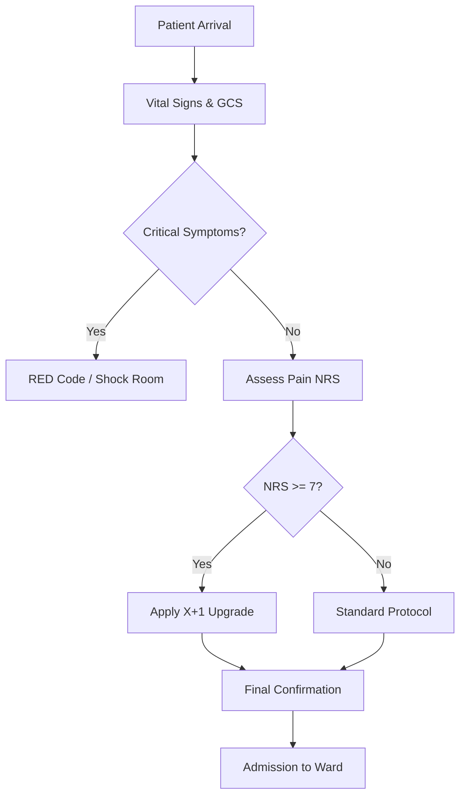

# 🏥 Tuscany Triage System — International Edition
### *Version 0.4.1 — Clinical Decision Support System*

An advanced **Clinical Decision Support System (CDSS)** designed to assist healthcare professionals in patient prioritization, following the official 5‑color (6‑level) protocol of the **Tuscany Region (Italy)**.

---

## 🚀 What's New in v0.4.1
This release marks the evolution from a simple data collector to a true clinical reasoning engine.

### 🧠 Clinical Decision Engine
* **Full Regional Hierarchy:** Integration of all 6 triage codes (White, Azure, Green, Yellow, Orange, Red).
* **GCS Module:** Automated calculation of the Glasgow Coma Scale.
* **NRS Pain Integration:** Pain treated as the 5th Vital Sign.

### ⚡ “X+1” Pain Logic
If a patient reports severe pain (**NRS ≥ 7**), the system automatically suggests upgrading the priority to the next level in the hierarchy (e.g., Green → Yellow).

### ⚠️ Safety Alerts: Clinical Congruency
A **Dubious Clinical Congruency Alert** cross‑checks high pain scores with stable vital signs (Heart Rate and Blood Pressure), prompting the operator to reassess psychophysical stress or potential malingering.

### 📊 Decision Workflow

## 🛠 Features & Normalization

|Feature | Description |
| :--- | :--- |
| **Data Integrity** | Patient names stored in lowercase for database consistency. |
| **UI Rendering** | Professional display using .title() formatting. |
| **Vital Cross‑Check** | Automatic Red Code trigger for SpO₂ < 90% or GCS ≤ 8. |
| **Live Dashboard** | Real‑time monitoring of ward workload by color code. |

---

## 📋 Triage Hierarchy Reference
Official **Tuscany Centro** priority scale:

1. 🔴 **RED** — Resuscitation / Immediate life‑threatening
2. 🟠 **ORANGE** — High risk / Evolutional urgency
3. 🟡 **YELLOW** — Mediated urgency
4. 🟢 **GREEN** — Deferred urgency
5. 🔵 **AZURE** — Minor urgency
6. ⚪ **WHITE** — Non‑urgent

---

> 🛡 Disclaimer
> [!IMPORTANT]
> This software is a simulation and decision‑support tool for educational purposes. It does not replace professional clinical judgment or official hospital protocols. ALWAYS TRUST YOUR CLINICAL EYES.

---
**Shift completed. High volume managed. Great job out there, stay safe.**
