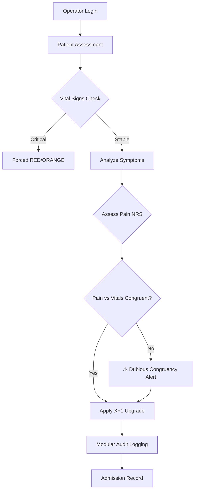

# 🏥 Tuscany Triage System — International Edition
### *Version 0.6.2 — Modular Architecture & Advanced CDSS*


## 🧬 Vision
>**Bridging the Gap Between Care and Code** 
>In high-pressure Emergency Departments, subtle clinical signs can be overlooked. 
>The Tuscany Triage System isn't meant to replace human intuition but to empower it. 
>By integrating clinical tools like the Shock Index and GCS directly into the triage workflow, 
>this system helps identify "silent" risks—like occult shock—before they become overt crises.

Developed by a healthcare professional, for healthcare professionals, this modular CDSS follows the official Tuscany Region protocols while maintaining a global perspective on patient safety.
## 🏗️ Modular Architecture (v0.6.2)
To ensure scalability and maintainability, the system has been refactored into a **three-tier modular structure**:

* **`main.py` (User Interface):** Manages the interaction flow, data collection, and operator confirmation.
* **`clinic.py` (Clinical Decision Engine):** Contains all medical logic, including GCS calculation, Shock Index analysis, and Symptom-to-Pathway mapping.
* **`utils.py` (System Services):** Provides robust input validation, secure audit logging, and UI helper functions.

### 🧠 Advanced Decision Engine
* **Clinical Congruency Check (New):** The system cross-references reported pain (NRS) with stable vital signs (HR/SBP). If severe pain is reported despite stable vitals, a "Dubious Congruency" alert is triggered for professional re-evaluation.
* **Hemodynamic Safety (Shock Index):** Detects occult shock (HR/SBP > 0.9) to prevent undertriage in compensating patients.
* **Intelligent Pathway Mapping:** Automatically suggests clinical pathways (e.g., Stroke Unit, Cardiac, Trauma) based on symptom keyword analysis.

### 📊 Decision Workflow

## 🚀 Quick Start
1. Ensure you have **Python 3.8+** installed.
2. Clone this repository or download all three files (`main.py`, `clinic.py`, `utils.py`) into the same folder.
3. Run the main script:
   ```bash
   python main.py
```

> [!IMPORTANT]
> ⚠️ **Medical Disclaimer: Educational and Simulation Purposes Only**
> This software is NOT a certified Medical Device and should NOT be used to make actual clinical decisions in a real-world healthcare setting. 
> The author is not responsible for any misuse or clinical outcomes resulting from the use of this code.