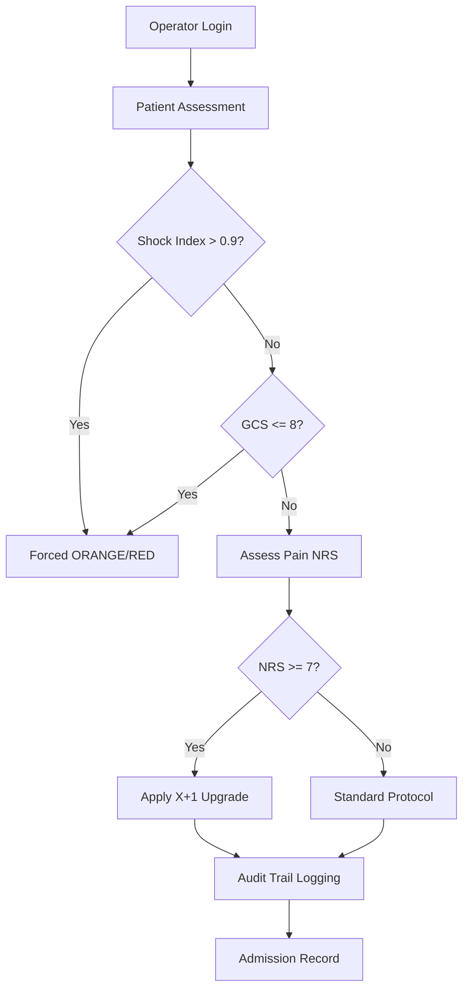

# 🏥 Tuscany Triage System — International Edition
### *Version 0.5.7 — Clinical Audit & Global Standard*

An advanced **Clinical Decision Support System (CDSS)** designed to assist healthcare professionals in patient prioritization, following the official 5‑color (6‑level) protocol of the **Tuscany Region (Italy)**.

---

## 🚀 What's New in v0.5.7
This release introduces professional-grade accountability and advanced hemodynamic monitoring.

### 🧠 Advanced Decision Engine
* **Hemodynamic Safety (Shock Index):** Automatic calculation of HR/SBP ratio to detect occult shock and prevent undertriage.
* **Full Clinical Audit Trail:** Every admission, manual override, and session start/end is recorded with timestamps in `triage_audit_log.txt`.
* **Operator Session Management:** Secure login system to track accountability per shift.
* **Interactive GCS Calculator:** Step-by-step assessment of Eyes, Verbal, and Motor responses.

### ⚡ “X+1” & Safety Logic
- **Pain Upgrade:** Severe pain (**NRS ≥ 7**) triggers an automatic priority upgrade.
- **Shock Index Override:** If $SI > 0.9$, the system forces an **ORANGE** code (High Risk) regardless of other stable parameters.
- **Neurological Hard-Stop:** GCS ≤ 8 automatically triggers a **RED** code.

### 📊 Decision Workflow

## 🛠 Features & Normalization

|Feature | Description                                                                                    |
| :--- |:-----------------------------------------------------------------------------------------------|
| **Audit Log** | Persistent storage of all clinical decisions for legal/clinical review.                        |
| **Manual Override** | Operators can deviate from system advice, but the action is logged with a justification trail. |
| **Data Integrity** | Standardized input normalization (.title() formatting).                                        |
| **SI Monitoring** | Real-time calculation of occult shock risk (HR/SBP).                                           |

---

## 📋 Triage Hierarchy Reference
Official **Tuscany Centro** priority scale:

1. 🔴 **RED** — Resuscitation / Immediate life‑threatening
2. 🟠 **ORANGE** — High risk / Evolutional urgency
3. 🟡 **YELLOW** — Mediated urgency
4. 🟢 **GREEN** — Deferred urgency
5. 🔵 **AZURE** — Minor urgency
6. ⚪ **WHITE** — Non‑urgent

---

## 📄 License

This project is licensed under the **GNU General Public License v3.0**.  
This means the software is, and will always remain, **Free and Open Source**. 

**Why GPL v3?** As a healthcare professional, I believe clinical logic should be a shared asset. This license ensures that any improvements or derivative works made by others must also be shared with the community under the same terms, preventing the "privatization" of this logic by proprietary entities.

See the [LICENSE](LICENSE) file for the full legal text.

> [!IMPORTANT]
> **Medical Disclaimer: Educational and Simulation Purposes Only**
>
> This software is NOT a certified Medical Device and should NOT be used to make actual clinical decisions in a real-world healthcare setting. The author is not responsible for any misuse or clinical outcomes resulting from the use of this code.

**Maintained by:** [Emanuele Tarchi](https://www.linkedin.com/in/emanuele-tarchi-it/)
*Healthcare Professional & Aspiring Software Engineer* "Building tools to support those on the frontline." 🏥💻
