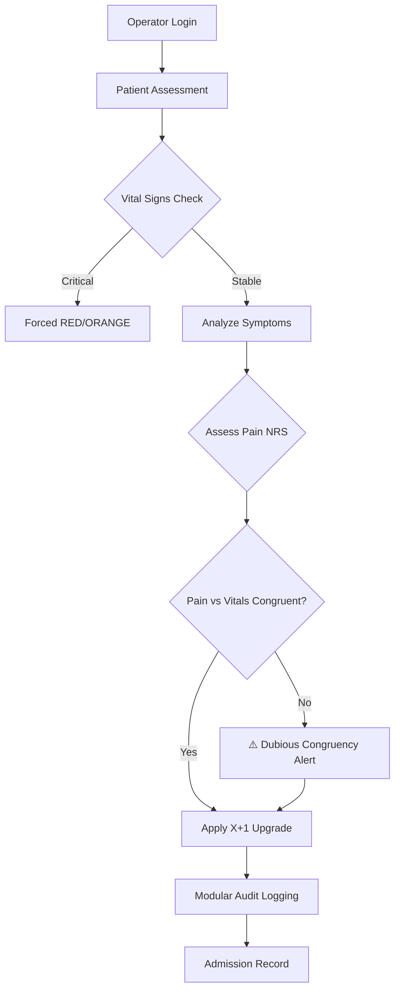

# 🏥 Tuscany Triage System — International Edition
### *Version 0.6.2 — Clinical Decision Support & GRC Compliance Framework*


---

## 🧬 Vision & Current Focus
> **Bridging the Gap Between Care, Code, and Compliance**  
> In high-pressure Emergency Departments, subtle clinical signs can be overlooked.  
> The Tuscany Triage System isn't meant to replace human intuition, but to empower it.  
> By integrating clinical tools like the Shock Index and GCS directly into the triage workflow, this system helps identify "silent" risks—like occult shock—before they become overt crises.

### 🛡️ Strategic Shift: GRC & Regulatory Governance
While the core Python implementation represents a stable baseline, **the current focus of this repository is not active software development, but Regulatory Governance, Compliance & Auditability (GRC)**. 

This repository serves as a real-world case study on how medical decision-support software is evaluated, audited, and protected under modern European regulatory frameworks:
* **EU AI Act (Regulation UE 2024/1689):** Categorized as a High-Risk System (Healthcare / Emergency Decision Support) with Human-in-the-Loop oversight.
* **Medical Device Regulation (MDR UE 2017/745):** Qualified as Software as a Medical Device (SaMD) Class IIa under Rule 11 (Annex VIII).
* **ISO/IEC 27001 & NIS2:** Auditability, non-repudiation logging, and healthcare infrastructure resilience.

---

## 📂 Repository Structure

    medical-triage-system/
    ├── src/                                  # Source Code (Stable Baseline)
    │   ├── main.py                           # UI Flow, Operator Login & HITL Override
    │   ├── clinic.py                         # Deterministic Clinical Engine & Safety Logic
    │   └── utils.py                          # Input Validation & Audit Logging
    │
    ├── governance/                           # 🛡️ GRC & REGULATORY COMPLIANCE ARTIFACTS
    │   ├── 01_EU_AI_Act_High_Risk_Assessment.md   # EU AI Act Art. 9, 10, 12, 13, 14 Mapping
    │   ├── 02_MDR_Rule11_SaMD_Classification.md   # Rule 11 SaMD Qualification (Class IIa)
    │   ├── 03_Clinical_Bias_and_Congruency_Spec.md# Algorithmic Safety & Congruency Engine
    │   └── 04_Auditability_and_Logging_Spec.md   # ISO 27001 A.12.4 & Non-Repudiation Spec
    │
    ├── docs/                                 # Executive Audit Deliverables (PDF)
    │   ├── Medical_Triage_EU_AI_Act_Compliance_Report.pdf
    │   └── SaMD_MDR_Regulatory_Readiness.pdf
    │
    ├── logs/                                 # Sample Audit Trails
    │   └── triage_audit_log.txt.example
    │
    └── README.md                             # Project Dashboard

---

## 🏗️ Modular Architecture & Clinical Engine (`src/`)

The software baseline relies on a **three-tier modular structure**:

* **`src/main.py` (User Interface & Governance):** Manages interaction flow, operator login, and mandatory human confirmation (`Human-in-the-Loop` override under EU AI Act Art. 14).
* **`src/clinic.py` (Clinical Decision Engine):** Implements medical logic, GCS calculation, Shock Index analysis, and Symptom-to-Pathway mapping.
* **`src/utils.py` (System Services):** Handles input validation, range checks, and audit trail generation (`ISO 27001 A.12.4`).

### 🧠 Key Clinical Features
* **Clinical Congruency Check:** Cross-references reported pain (NRS) with stable vital signs (HR/SBP). If severe pain is reported despite stable vitals, a "Dubious Congruency" alert is raised to prevent automation bias.
* **Hemodynamic Safety (Shock Index):** Detects occult shock (HR/SBP > 0.9) to prevent under-triage in compensating patients.
* **Intelligent Pathway Mapping:** Recommends clinical pathways (e.g., Stroke Unit, Cardiac, Trauma) based on symptom keyword analysis.

---

## 📊 Decision Workflow


```mermaid
graph TD
    A[Operator Login] --> B[Patient Assessment]
    B --> C{Vital Signs Check}
    C -- Critical --> D[Forced RED/ORANGE]
    C -- Stable --> E[Analyze Symptoms]
    E --> F{Assess Pain NRS}
    F --> G{Pain vs Vitals Congruent?}
    G -- No --> H[⚠️ Dubious Congruency Alert]
    G -- Yes --> I[Apply X+1 Upgrade]
    H --> I
    I --> L[Modular Audit Logging]
    L --> M[Admission Record]
```
---

## 🚀 Quick Start & Execution

1. Ensure you have **Python 3.8+** installed.
2. Clone this repository.
3. Run the main script from the root directory:
   ```bash
   python src/main.py
   ```
## ⚠️ Medical & Legal Disclaimer

> **Educational & Portfolio Demonstration Purpose Only**  
> This software is developed for research, educational, and Governance, Risk & Compliance (GRC) demonstration purposes. It is NOT a certified Medical Device and should NOT be used to make actual clinical decisions in real-world healthcare settings. The author assumes no liability for misuse or clinical outcomes resulting from this code.

